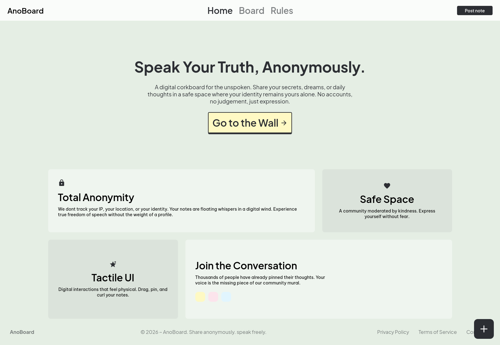
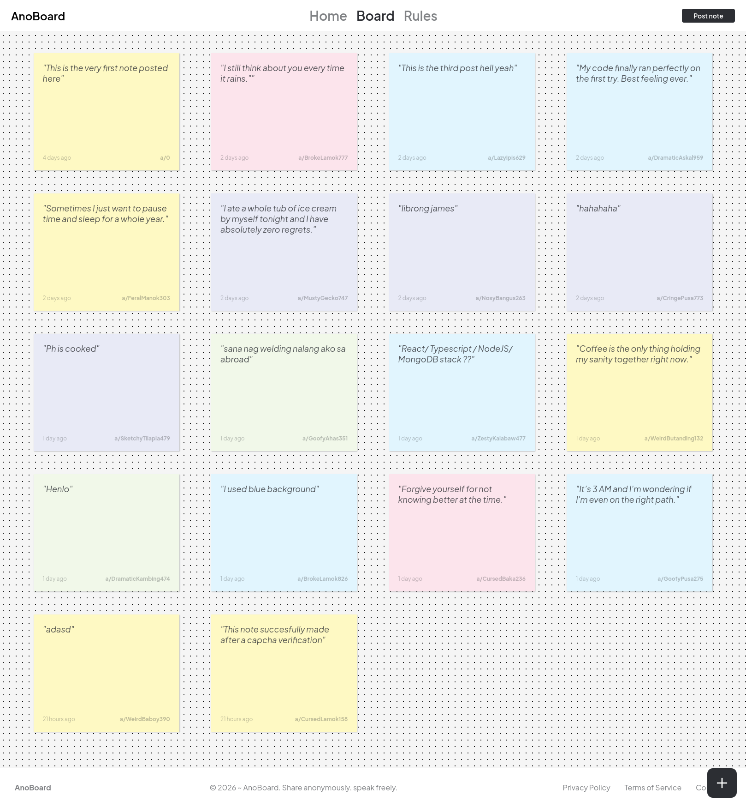
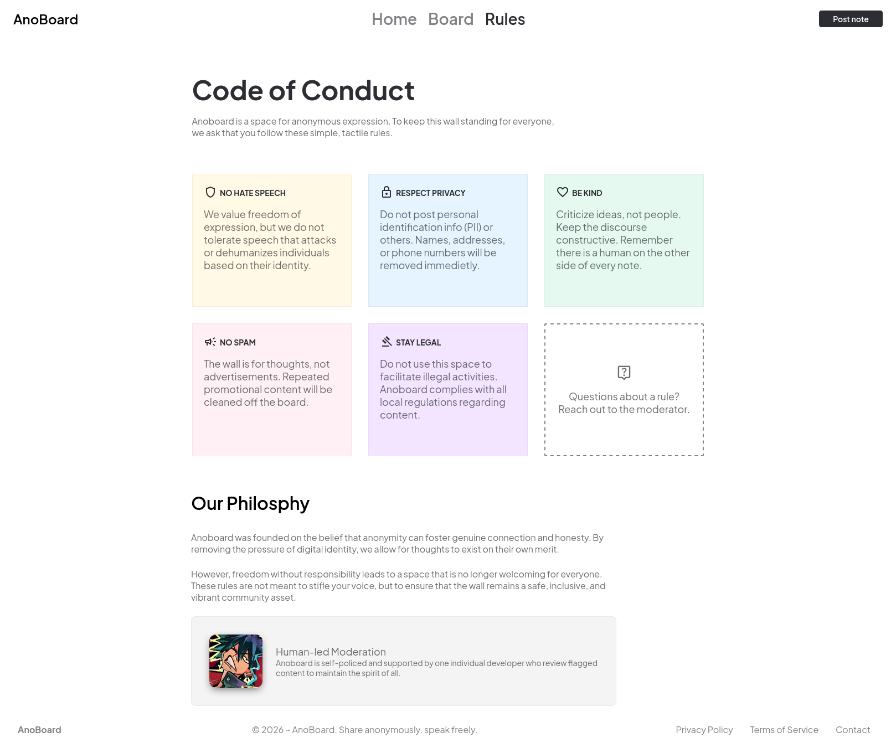

# ANOBOARD
AnoBoard is a simple digital corkboard for the unspoken. Where you can share your secrets, dreams, or daily thoughts in a safe space where your identity remains yours alone. No accounts, no judgement, just expression.

## Screenshots




## Features
*   **100% Anonymous Posting:** Users can share their thoughts without creating an account or leaving identifiable footprints. We strictly enforce zero-ip tracking policy by encrypting user IPs and user agents using salted SHA256 hashes. Your identity never touches our database.
*   **Digital Corkboard Interface:** A simple, intuitive, and visually appealing layout for reading messages.
*   **Instant Expression:** Seamlessly write and post daily thoughts, secrets, or dreams in real-time.
*   **Safe Space:** Designed to foster a judgment-free environment for unspoken words.
*   **Spam Protection:** Integrated Cloudflare Turnstile ensures a bot-free wall without compromising user privacy.

## Tech Stack
- **Frontend**: HTML5, CSS3, Javascript
- **Backend**: PHP 8.3.6
- **Database**: MySQL, Apache
- **Security**: Cloudflare Turnstile
- **UI/UX Design**: Figma


## Prerequisites
*   [XAMPP](https://www.apachefriends.org/index.html) installed on your system.
*   [Git](https://git-scm.com/) installed (optional, for cloning).
*   A code editor like VS Code.
## Installation

1.  **Clone or Download the Repository:**
    *   Navigate to your XAMPP `htdocs` folder (usually `C:\xampp\htdocs` on Windows).
    *   Clone the repository inside `htdocs`:
        ```bash
        git clone [https://github.com/peanutbutterchicken/anoboard.git](https://github.com/peanutbutterchicken/anoboard.git)

2. **Start the Local Server:**
    *   Open the XAMPP Control Panel.
    *   Start both the Apache and MySQL modules.

3. **Set Up the Database:**
    *   Open your web browser and go to http://localhost/phpmyadmin/.
    *   Create a new database named db_anoboard
    *   Navigate to the Import tab.
    *   Upload the `database/schema.sql` file provided in the repository to set up the necessary tables.

4. **Configure the Environment:**
    *   Rename `.env.example` to `.env` and provide your Cloudflare Turnstile keys and a random rate-limit salt.
    *   Create a `config/` directory in the root folder.
    *   Move and rename `config.database_config.example.php` to `config/database_config.php` and update it with your local MySQL credentials.

5. **Run the Application:**
    *   Open your web browser and navigate to http://localhost/anoboard (make sure the folder name matches your directory in htdocs).
## Contributing

Contributions, issues, and feature requests are welcome!

1. Fork the project.

2. Create your feature branch (git checkout -b feature/AmazingFeature).

3. Commit your changes (git commit -m 'Add some AmazingFeature').

4. Push to the branch (git push origin feature/AmazingFeature).

5. Open a Pull Request

## License
Distributed under the [MIT](https://choosealicense.com/licenses/mit/) License. See LICENSE for more information.
